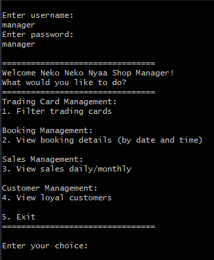
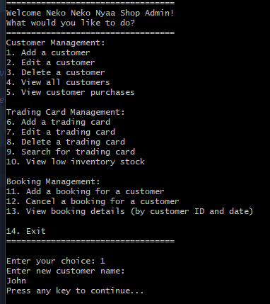

# Trading Card Shop Management Application
A CLI based application to practice OOP principles in C#. This project is a console application that simulates a trading card shop management system. The application allows a manager and a shop admin to manage customers, trading cards, and bookings.

## Features

- **Manager:**
  - View and filter trading cards
  - View booking details by date and time
  - View loyal customers
  - View sales daily or monthly

- **Shop Admin:**
  - Add, edit, and delete customers
  - Add, edit, and delete trading cards
  - Search for trading cards
  - View low inventory stock
  - Add and cancel bookings for customers
  - View customer purchases
  - View booking details for a customer on a specific date

## Predefined Data

The application initializes with predefined customers, orders, and bookings:

- **Customers:**
  - 5 Customers

- **Orders:**
  - Membership
  - Trading Card
  - Booking

- **Bookings:**
  - Booking1: June 22, 2024, 05:00 - 08:00
  - Booking2: February 26, 2024, 14:00 - 17:00
  - Booking3: November 30, 2024, 18:00 - 21:00

## Usage

1. **Manager Login:**
   - Username: `manager`
   - Password: `manager`

2. **Shop Admin Login:**
   - Username: `admin`
   - Password: `admin`

## Screenshot of Application in Console

  
  &nbsp;&nbsp;&nbsp;&nbsp;&nbsp;&nbsp;
  

## Disclaimer
This project was originally completed as an assignment and has been uploaded to GitHub at a later date due to limited OneDrive storage. As a result, the commit history may not accurately reflect the development process, and there may be only a few commits for the project.
